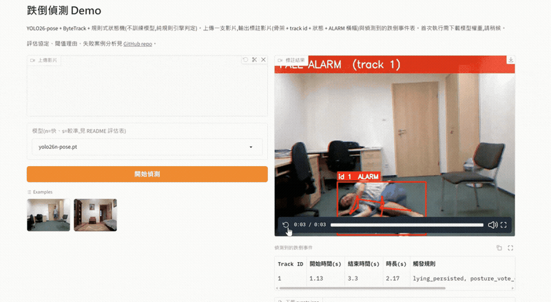
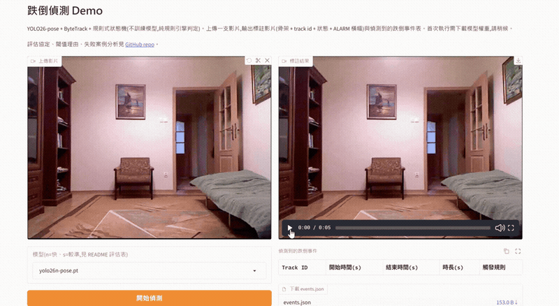
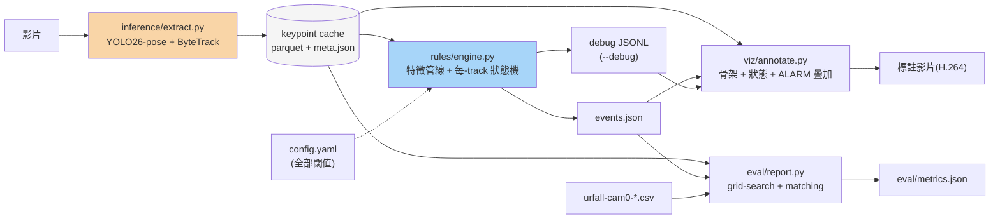

# fall-detection-pose

[](LICENSE)
[](pyproject.toml)
[](https://colab.research.google.com/github/tun0000/fall-detection-pose/blob/main/notebooks/05_gradio_demo.ipynb)

以 **YOLO26-pose 預訓練模型 + ByteTrack 多目標追蹤**為基礎的規則式(rule-based)跌倒偵測系統。
本專案重點不在模型創新,而在工程能力:

- **可解釋的規則引擎**:每個 track 一台狀態機(UPRIGHT → FALLING → FALLEN → ALARM),
  所有閾值集中於 [config.yaml](config.yaml),每個值附選擇理由與文獻出處。
- **event-level 誠實評估**:在 UR Fall Detection Dataset(30 falls + 40 ADL)上以
  明確定義的事件配對協定計算 precision / recall / F1;tune/test 切分防止「在測試集上調參」。
- **失敗分析**:對誤報與漏報案例附特徵時序圖,展示規則「為什麼」觸發或錯過。
- **推論與規則解耦**:GPU 只跑一次姿態抽取落成 keypoint cache,調參/評估為秒級 CPU 工作。

## Demo

<table>
<tr><td align="center"><b>跌倒 → 正確觸發 ALARM</b></td></tr>
<tr><td align="center"></td></tr>
<tr><td align="center"><b>日常動作(ADL)→ 正確不觸發</b></td></tr>
<tr><td align="center"></td></tr>
</table>

兩支都是實際跑完整條 pipeline 的畫面(非後製剪輯),用
[notebooks/05_gradio_demo.ipynb](notebooks/05_gradio_demo.ipynb) 啟動的 Gradio demo 直接
螢幕錄影:`fall-06`(tune split)展示跌倒正確觸發紅色 ALARM 橫幅;`adl-01`(test split)
展示日常動作(過程中甚至有蹲下這種容易與跌倒混淆的姿勢)全程正確保持 UPRIGHT、不誤觸。

## 快速開始

**在瀏覽器裡試(不用裝任何東西)**:點下表任一 notebook 的 Colab 徽章,
`Runtime → Run all`——每一本都是自包含的(clone repo、裝依賴、跑單元測試)。

| Notebook | 內容 | |
|---|---|---|
| `01_smoke_test.ipynb` | 2 支短片(1 fall + 1 ADL)端到端煙測 | [](https://colab.research.google.com/github/tun0000/fall-detection-pose/blob/main/notebooks/01_smoke_test.ipynb) |
| `02_extract_urfd.ipynb` | URFD 全量下載 + 兩模型抽 keypoint cache【唯一需要 GPU 的步驟】 | [](https://colab.research.google.com/github/tun0000/fall-detection-pose/blob/main/notebooks/02_extract_urfd.ipynb) |
| `03_tune_eval.ipynb` | tune split 網格調參 → 凍結 config → test split 定稿 + 失敗分析 | [](https://colab.research.google.com/github/tun0000/fall-detection-pose/blob/main/notebooks/03_tune_eval.ipynb) |
| `04_benchmark.ipynb` | FPS/延遲 benchmark 矩陣 | [](https://colab.research.google.com/github/tun0000/fall-detection-pose/blob/main/notebooks/04_benchmark.ipynb) |
| `05_gradio_demo.ipynb` | 啟動 Gradio demo(上方兩張 GIF 就是這樣錄的) | [](https://colab.research.google.com/github/tun0000/fall-detection-pose/blob/main/notebooks/05_gradio_demo.ipynb) |

**本機 CLI**(`detect` 只吃 keypoint cache,無需 GPU/`[infer]`;`extract`/`annotate`/`bench`
需要 `[infer]`,其中 `extract` 建議上 GPU):

```bash
uv sync                              # 核心依賴(規則引擎、評估,無 torch)
uv run pytest                        # 86 個單元測試,秒級,無需 GPU
pip install -e ".[infer,demo]"       # 加裝推論(ultralytics/opencv)與 Gradio demo

fdp pipeline --source video.mp4 --out-dir outputs/   # extract → detect → annotate 一條龍
fdp bench --video video.mp4 --model yolo26n-pose.pt --model yolo26s-pose.pt
python -m fall_detection.app.gradio_app --no-share    # 本機跑 demo(不建立公開連結)
```

## 架構



只有 `extract`(GPU 姿態推論)是重的一步;其餘全部吃 cache 好的 keypoint parquet,
CPU 秒級跑完,這是整個專案「推論與規則解耦」的核心設計。`app/gradio_app.py`
(Gradio demo)不是額外的一條路徑,就是直接依序呼叫 `extract` → `engine` →
`annotate` 這三個函式,沒有另外的邏輯。

## 判斷邏輯

**特徵**(像素座標,y 向下;只用 conf ≥ `kpt_conf_min` 的關鍵點,詳見
[features.py](src/fall_detection/rules/features.py)):

- 肩中點 S、髖中點 H(任一側不可見則取可見側;兩側都不可見則整幀 invalid)。
- 軀幹長 `L = ‖H − S‖`,取滑動中位數 `L̃` 當作該 track 的尺度單位——後續量全部
  正規化成「軀幹長的倍數」,不受解析度或鏡頭距離影響。
- 軀幹傾角 `θ = atan2(|H.x − S.x|, H.y − S.y)`:直立 ≈ 0°、橫躺 ≈ 90°。
- bbox 寬高比 `r = w / h`。
- 髖-踝相對高度 `h_hip = (踝.y − H.y) / L̃`:站立時髖遠高於踝(數值大),躺地時
  髖踝同高(趨近 0);踝不可見時不參與投票,不硬猜。
- 垂直速度 `v_norm`:髖 y 座標先 3 點中位數濾波,再用固定時間窗差分並除以
  `L̃` 正規化——單位是「軀幹長/秒」,同一支影片用 30fps 或 15fps 重採樣算出來
  的事件起訖時間差 <0.2s(見 `tests/test_engine.py` 的 fps 不變性測試)。
- 關鍵點缺測用 hold-last(TTL = `max_kpt_gap_s`),躺地後 pose 模型常整段掉點,
  不能讓缺測直接判定「站起來了」。

**狀態機**(每個 track 各自一台,見 [state_machine.py](src/fall_detection/rules/state_machine.py)):

```
UPRIGHT ──(v_norm > v_fall_enter 或 ω > omega_enter)──▶ FALLING
FALLING ──(躺姿 2-of-3 投票,window_confirm_s 內達 vote_ratio)──▶ FALLEN
FALLING ──(t_falling_timeout_s 內未確認)──▶ UPRIGHT   (回退不出事件,擋快速坐下/蹲下)
FALLEN  ──(持續躺姿 t_confirm_fallen_s)──▶ ALARM        (此刻才「確認」一次跌倒)
FALLEN/ALARM ──(回正持續 t_recover_s,遲滯出口閾值)──▶ UPRIGHT
FALLEN/FALLING 中 track 消失或影片結束 ──▶ 仍收尾成一次事件(見下)
```

躺姿投票取 `[θ > theta_lying_enter, r > r_lying, h_hip < h_hip_lying]` **三取二**:
單一幾何特徵在特定視角都會失效(朝鏡頭跌倒時 r 可能不變、側躺時 θ 不到 90°),
投票機制吸收單一特徵的盲區(GMDCSA 單規則法在 URFD specificity 僅 72.5% 的教訓)。

**收尾規則(`finalize()`)**——track 消失或影片結束時:已在 ALARM 直接收尾;卡在
FALLEN(躺姿已投票確認,但撐不滿 `t_confirm_fallen_s`)也收尾成一次事件;卡在
FALLING 但最後一次平滑觀測已符合躺姿投票同樣收尾。三者背後同一個判斷:與其讓
一次真實跌倒因為 track 提早消失就整個漏判,寧可信任最後一次可信觀測(代價與
邊界情況見下方「失敗分析」`fall-08` 案例、以及「已知限制」)。

**關鍵閾值**(tune split 網格搜尋校準,完整清單與逐項理由見 [config.yaml](config.yaml)):

| 閾值 | 值 | 意義 |
|---|---|---|
| `kpt_conf_min` | 0.25 | 關鍵點可見門檻 |
| `v_fall_enter` | 0.8 軀幹長/s | 進入 FALLING 的垂直速度門檻 |
| `theta_lying_enter` | 40° | 躺姿投票之一(見「已知限制」的類外泛化風險) |
| `window_confirm_s` / `vote_ratio` | 0.4s / 0.8 | 躺姿投票視窗與通過比例 |
| `t_confirm_fallen_s` | 0.3s | FALLEN → ALARM 的持續確認時間 |

## 狀態

| 里程碑 | 內容 | 狀態 |
|---|---|---|
| M0 | 專案骨架 | ✅ |
| M1 | 規則引擎 + 合成軌跡單元測試 | ✅ |
| M2 | 推論 pipeline + 煙測 notebook | ✅ |
| M3 | URFD 全量抽取 | ✅ |
| M4 | 閾值校準 + 評估 + 失敗分析 | ✅ |
| M5 | FPS benchmark | ✅ |
| M6 | Gradio demo | ✅ |
| M7 | README 定稿 | ✅ |

## 評估

協定:event-level 配對,預測與 GT ± 0.5s 容忍窗內有任何時間交集即視為候選,
每個 GT 貪婪配對交集最大的一個預測(一對一)。ADL 影片一律視為 0 個跌倒 GT
——即使該影片的姿態標註本身出現「躺姿」區間(URFD 的 ADL 集合刻意包含主動
躺下,如躺床上,用來測試誤報率),任何預測事件都算 FP。閾值全部在 tune split
(10 falls + 13 adls)網格搜尋校準凍結(見 [config.yaml](config.yaml));
以下為 **test split**(20 falls + 27 adls,從未參與調參)的結果,原始數字見
[eval/metrics.json](eval/metrics.json)。

| 模型 | Precision | Recall | F1 | Video-level Specificity |
|---|---|---|---|---|
| yolo26n-pose(預設) | 0.600 | 0.600 | 0.600 | 0.741 |
| yolo26s-pose | 0.611 | 0.550 | 0.579 | 0.778 |

調參經過兩輪:第一輪勝出的 4 個閾值全部卡在候選範圍邊緣(方法論警訊,代表
範圍切太窄);往更敏感方向擴大網格、並修掉一個結構性 bug(track 消失時最後
觀測已符合躺姿卻沒收尾成事件)後,第二輪 F1(yolo26n-pose)從 0.457 提升到
0.600。調參準則:recall 優先、precision ≥ 0.5 才列入候選——跌倒漏判(沒人去
查看)的代價高於一次誤報。

**與文獻數字的對照**(僅供量級參考,見下方注意事項):

| 方法 | Precision | Recall / Sensitivity | F1 |
|---|---|---|---|
| 本專案(yolo26n-pose,test split) | 0.600 | 0.600 | 0.600 |
| GMDCSA(規則法,URFD) | — | 91.67 | —(specificity 72.50) |
| PIFR(2025) | 88.8 | 94.1 | 91.4 |
| Núñez-Marcos et al. 2017(CNN,需訓練) | — | — | acc 98.63 |

**這張表不是拿來宣稱贏過或輸給誰**——各方法的評估協定(事件配對容忍窗、
正類定義、有沒有 tune/test 切分)、資料前處理都不同,數字量級不同不代表方法
優劣。本專案的協定在上面完整揭露、切分名單凍結進版控([eval/splits.yaml](eval/splits.yaml)),
任何人都能重現或挑戰這個數字——這是刻意的設計取捨:比起一個無法重現出處的
高分,一個協定透明、可重現的中等分數對這個作品集的目的更有價值。

## Benchmark

固定一支 URFD 重組影片(`adl-01.mp4`,150 幀,實際可用幀數誠實回報而非湊滿
300)先整支解碼進記憶體,`{yolo26n-pose, yolo26s-pose} x {GPU FP32, GPU FP16,
CPU}` 各跑 3 輪取中位數;GPU 計時前後夾 `torch.cuda.synchronize()`,CPU 為
Colab 標準 2 vCPU(數字偏低,誠實照報)。**不引用官方「CPU 快 43%」的宣傳
數字**——那是 detect 模型的 ONNX 匯出數字,不適用本專案的 pose 模型。原始
數字見 [bench.json](bench.json)。

| 模型 | 裝置 | 端到端 FPS | p50 延遲 | p95 延遲 |
|---|---|---|---|---|
| yolo26n-pose | GPU(T4)FP32 | 59.65 | 13.84ms | 23.52ms |
| yolo26n-pose | GPU(T4)FP16 | 64.64 | 15.63ms | 24.25ms |
| yolo26n-pose | CPU(2 vCPU) | 8.23 | 116.96ms | 178.96ms |
| yolo26s-pose | GPU(T4)FP32 | 72.25 | 13.88ms | 20.40ms |
| yolo26s-pose | GPU(T4)FP16 | 66.18 | 14.69ms | 24.09ms |
| yolo26s-pose | CPU(2 vCPU) | 3.36 | 271.15ms | 408.98ms |

兩個模型在 GPU 上都遠超即時(30fps)所需;CPU 上 `yolo26n-pose` 仍有 8+ FPS
堪用,`yolo26s-pose` 掉到 3.36 FPS 明顯吃緊。GPU 對較大模型的加速幅度也更大
(n:~7.3x、s:~21.5x),符合計算量較重的模型從平行化得利更多的預期。

**測出來的兩個反直覺數字,誠實報告、不隱藏**:
- `yolo26s-pose` 在 GPU 上量到比 `yolo26n-pose` 更快(73.53 vs 60.65 FPS
  純推論)。CPU 上兩者關係符合預期(s 比 n 慢 ~2.45 倍,計算量差異的合理
  反映),因此 GPU 這個反轉不太像是程式呼叫錯模型的 bug,較可能是量測順序
  效應(n 先跑,GPU/CUDA kernel 尚未完全暖機)或 Colab 共用 T4 的量測雜訊
  ——樣本數(150 幀 x 3 輪)不足以下更強的結論。
- FP16 對 `yolo26n-pose` 有加速(+8.3%),對 `yolo26s-pose` 反而略慢(-8.6%),
  同樣可能是雜訊,也可能反映小模型的 FP16 casting 額外開銷相對計算量比例
  較大,抵銷部分理論加速。
- benchmark 腳本(`fdp bench` 或 `src/fall_detection/bench/benchmark.py`)
  可攜,任何機器都能補跑一列驗證,不綁定本次 Colab session 的結果。

## 失敗分析

從 test split 挑 1 個漏報(FN)+ 2 個誤報(FP),展示規則引擎「為什麼」錯過或
誤觸發(特徵時序圖見 `notebooks/03_tune_eval.ipynb` 失敗案例分析格):

**FN — `fall-21`**:追蹤器在跌倒的視覺證據真正成形前就整個失去目標。全程軀幹
傾角(θ)只有 0-6°、bbox 寬高比只有 ~0.3,沒有任何躺姿跡象;垂直速度確實
持續爬升,但直到資料結束前才剛好接近門檻,track 就消失了。這是**追蹤持續度**
的限制,不是閾值問題——沒有更多資料,任何規則法都生不出證據。

**FP — `adl-34`**:URFD 的 ADL 集合刻意包含「主動躺下」的日常動作(測試系統
會不會把臥床誤判成跌倒)。這支影片裡 θ 在 6 秒多內反覆於躺姿(~90°)與非躺姿
(~20-30°)之間震盪多次,是「躺下→坐起→躺下…」的主動調整,而非一次性站立→
跌倒→臥地不動。系統從純幾何角度正確判斷「持續符合躺姿」,但協定規定 ADL 影片
零 GT——這是規則法在「主動躺下 vs. 跌倒臥地」上幾何不可分辨的已知極限。
(附帶一提:雖然姿態震盪劇烈,因全程同一個 track id,靠回正需要「持續」的
遲滯設計撐住,並沒有被切成好幾段事件——跟下一個案例形成對比。)

**FP — `fall-08`**:這支**其實是真實跌倒**,但被切成兩個 track id(ByteTrack
在跌倒過程一次短暫的姿態回彈時斷了 id)。兩段預測分別是 `[0.933s,2.233s]`
(track 1,靠 finalize-while-FALLEN 修正正確收尾,對到 GT 算 TP)與
`[2.367s,3.0s]`(track 2,全新 id 重新觸發,判定為「重複預測」算 FP)。根本
原因是**縫合機制與事件合併機制之間的縫隙**:track 縫合靠 bbox IoU + 時間視窗
判斷是否同一人,這次因短暫回彈使 bbox 形狀變化過大沒縫上;事件合併只看
track id 鏈是否有交集,縫合一旦失敗就無法回頭補救,即使兩段事件時間相鄰、
位置相同。

## 已知限制與未來工作

- **`theta_lying_enter=40°` 低於文獻安全下限**:tune split 網格調參結果比
  Chen et al. 建議的 45° 更低(該研究指出 45° 會誤判深彎腰)。這 70 支 URFD
  影片沒有彎腰類 ADL 可測出此風險,是刻意接受的類外泛化風險——換到有彎腰/
  伸展動作的場域需重新校準。
- **track 縫合/事件合併縫隙**(見上方 `fall-08` 分析):跨 track id 鏈的事件
  合併目前只認 id 交集,不認時間相鄰 + 空間鄰近。
- **收尾事件不一定會顯示即時 ALARM 畫面**:`track_lost_while_fallen` 這類收尾
  規則能正確記錄事件,但如果一次跌倒過程 track id 反覆中斷(如 `fall-01`:
  1→3→5 換了三次),「持續躺姿」的計時會跟著中斷重算,狀態機永遠撐不到即時
  的 FALLEN→ALARM 轉換,只能靠影片結束時的收尾機制補判——事件本身正確,但
  標註影片上看不到紅色 ALARM 橫幅。demo GIF 因此選了 track id 全程穩定的
  `fall-06`,而非最早測試、更能體現縫合機制韌性的 `fall-01`。
- **慢速跌倒是規則法已知盲區**(見 `tests/test_engine.py` 的
  `test_slow_lie_down_no_event`):速度/角速度是進入 FALLING 的必要條件,
  刻意緩慢的跌倒或躺下不會觸發。
- **`model.conf` 無法事後調參**:偵測信心門檻在 GPU extract 階段就烘進
  keypoint cache,調整需要重新抽取,不像規則引擎閾值能在 CPU 上秒級迭代。
- **多人重疊/遮擋未經系統性測試**:URFD 每支影片都是單人。`rules/engine.py`
  架構上是「每個 track_id 一台獨立狀態機」,原生支援多人,但多人互相遮擋時
  keypoint 品質、ByteTrack 的多人關聯穩定度都沒有實測驗證。
- **鏡頭角度/跨資料集泛化未驗證**:所有閾值都是對 URFD 固定側視角、640x480
  鏡頭校準;換成俯視角、魚眼鏡頭或另一個資料集,幾何特徵的合理範圍可能整套
  失準,需要重新校準,不是直接遷移這份 config.yaml 的數字。
- **未做邊緣裝置匯出**:Benchmark 只測了 PyTorch 直接推論(GPU/CPU);
  ultralytics 原生支援 TensorRT/ONNX 匯出,但匯出後的精度/速度是否一致
  本專案沒有驗證,是明確的未來工作方向。

## 專案結構

```
fall-detection-pose/
├── pyproject.toml       # uv;依賴分層:core(規則引擎)/ [infer](GPU 推論)/ [demo](Gradio)/ [plot]
├── config.yaml          # 全部可調參數,每項附選擇理由與 tune-split 校準紀錄
├── plan.md              # 原始實作計畫(核准後逐里程碑執行)
├── eval/splits.yaml     # tune/test 切分名單(seed=42,凍結進版控)
├── eval/metrics.json    # 評估原始數字(README 表格皆從此生成,不手填)
├── bench.json           # benchmark 原始數字
├── assets/              # demo GIF
├── src/fall_detection/
│   ├── config.py         # pydantic 載入/驗證 config.yaml,非法值 fail-fast
│   ├── cli.py             # fdp:extract / detect / annotate / pipeline / bench
│   ├── io/                # video(H.264 重編碼)、cache(parquet)、urfd(下載 + GT 解析)
│   ├── inference/         # pose_tracker(YOLO26-pose + ByteTrack)、extract(唯一 GPU 步驟)
│   ├── rules/              # features(純幾何)、smoothing、state_machine(FSM)、engine(track 縫合)
│   ├── events/schema.py   # FallEvent、事件合併/濾短、events.json 序列化
│   ├── viz/annotate.py    # 標註影片輸出(H.264)
│   ├── eval/               # ground_truth、matching、report(grid-search)、splits
│   ├── bench/benchmark.py # FPS/延遲量測
│   └── app/gradio_app.py # Gradio 6 demo
├── notebooks/            # 01 煙測 → 02 URFD 抽取 → 03 調參評估 → 04 benchmark → 05 demo
└── tests/                 # 合成軌跡單測;rules/events/eval/bench 全部離線可測(無需 GPU)
```

## 資料集聲明

評估使用 [UR Fall Detection Dataset](https://fenix.ur.edu.pl/~mkepski/ds/uf.html)
(CC BY-NC-SA 4.0,**不隨本 repo 散布**,由下載腳本自官方站取得):

> Bogdan Kwolek, Michal Kepski, "Human fall detection on embedded platform using
> depth maps and wireless accelerometer", *Computer Methods and Programs in
> Biomedicine*, Vol. 117, Issue 3, 2014, pp. 489–501.
> DOI: [10.1016/j.cmpb.2014.09.005](https://doi.org/10.1016/j.cmpb.2014.09.005)

## License

程式碼採 [MIT](LICENSE);資料集授權見上。
